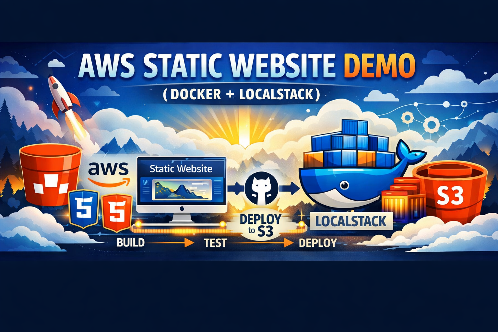

# AWS Static Website Demo (Docker + LocalStack)

  
🔗 [Live Preview](http://static-website-demo.s3-website-af-south-1.amazonaws.com)

Meet my Husky — guarding the pipeline from build to deploy.  
This project demonstrates a complete workflow: local development, CI/CD automation, and cloud deployment.

---

## 📖 Overview
This repository showcases how to deploy a static website using **AWS S3**.  
It includes a simple HTML/CSS site (`index.html`, `style.css`) and demonstrates version control with GitHub, automated deployment with GitHub Actions, and local AWS simulation using Docker + LocalStack.

---

## 🧰 Technologies Used
- **HTML5 & CSS3** — Static site structure and styling
- **Git & GitHub** — Version control and collaboration
- **AWS S3** — Static hosting target
- **Docker + LocalStack** — Local AWS simulation
- **GitHub Actions** — CI/CD pipeline automation

---

## ⚙️ Setup Instructions
1. Clone the repository:
   ```bash
   git clone https://github.com/Revaun/aws-static-website-demo.git
