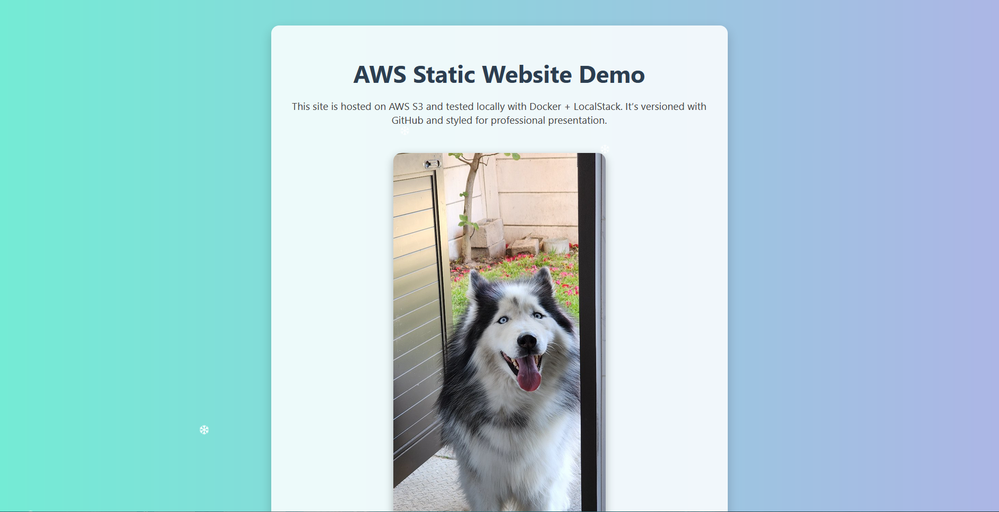

# AWS Static Website Demo (Docker + LocalStack)

  
🔗 [Live Preview](http://revaun-static-website-demo.s3-website.af-south-1.amazonaws.com)

Meet my Husky Echo — guarding the pipeline from build to deploy.  
This project demonstrates a complete workflow: local development, CI/CD automation, and cloud deployment.

---

## 📸 Deployment Proof

### Step 1 – Bucket Setup

### Step 2 – Static Hosting Enabled

### Step 3 – Public Access Policy

### Step 4 – Website Endpoint

### Step 5 – GitHub Actions Badge

### Step 6 – Final Result

