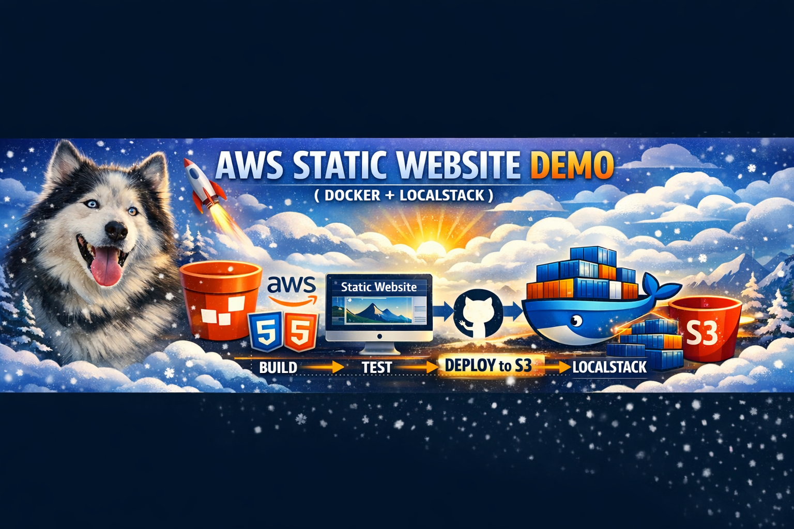
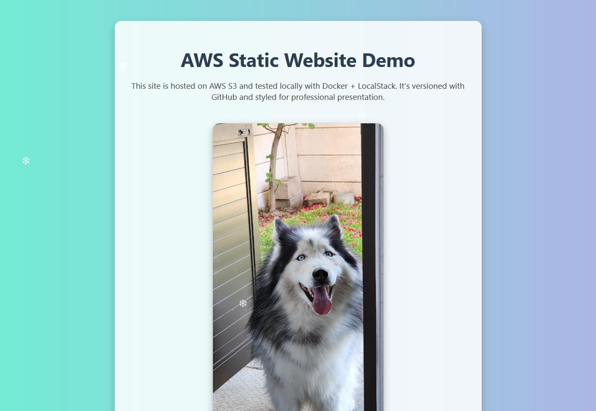
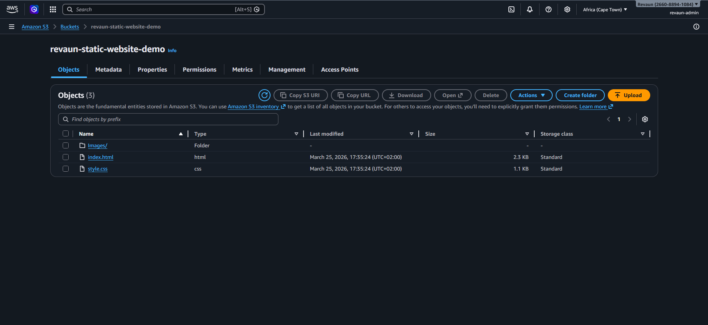
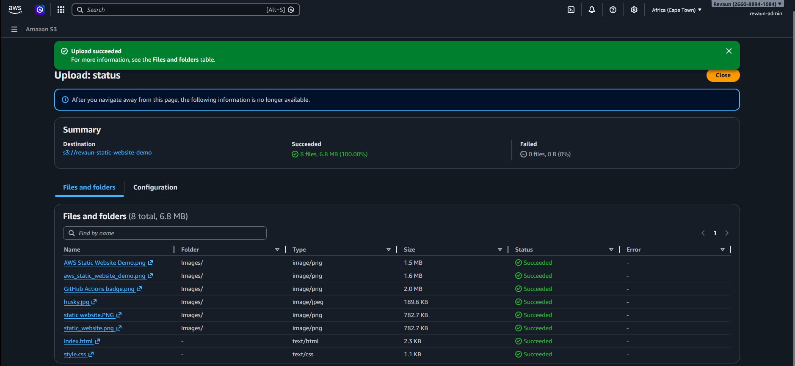
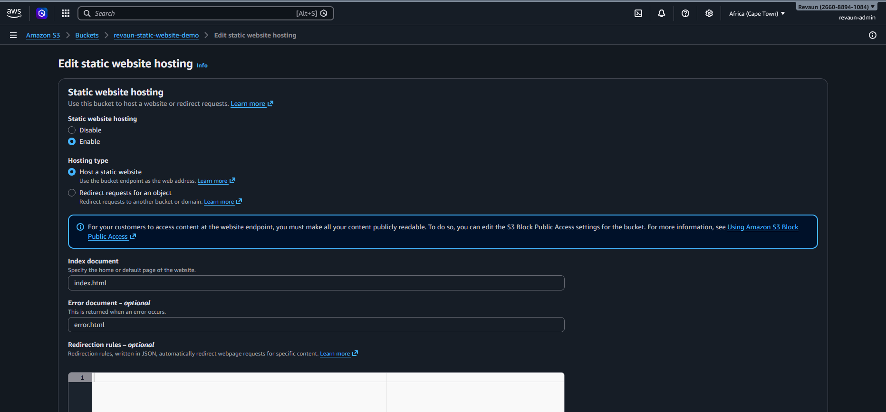
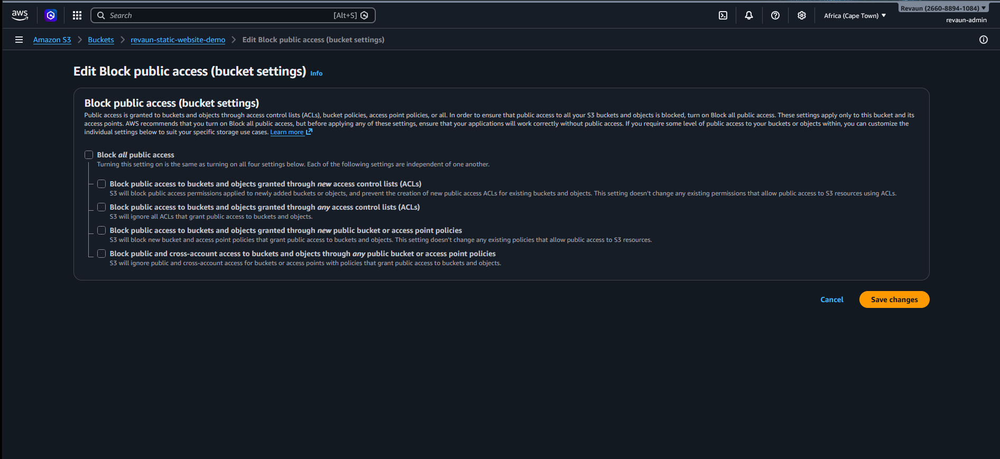
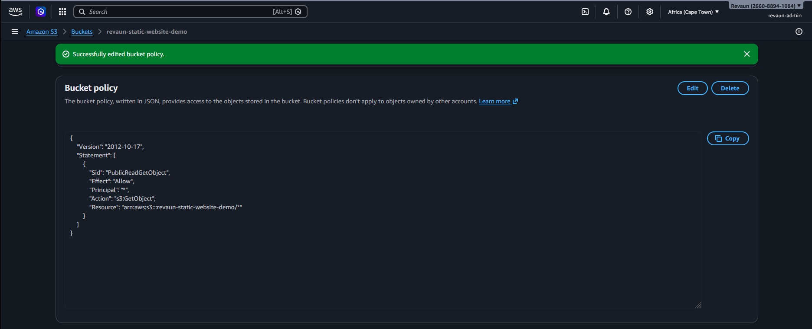

# Echo the Husky meets AWS CI/CD 🐾

## Highlights
- AWS S3 static website hosting
- IAM security best practices
- LocalStack integration for cost-free testing
- GitHub Actions CI/CD pipeline
- Recruiter-ready proof snapshots

👉 [View the GitHub Repository](https://github.com/Revaun/aws-static-website-demo)

## 📸 Live Site Snapshot
Here’s Echo the Husky guarding the pipeline, served directly from S3:

---

## 🚀 Project Importance
- Hands‑on AWS security and DevOps demonstration.
- CI/CD pipeline integration with GitHub Actions.
- Recruiter‑ready documentation with snapshots and badges.
- Clear proof of troubleshooting and deployment skills.

---

## 📸 Deployment Proof

### Step 1 – Bucket Creation

### Step 2 – Files Uploaded

### Step 3 – Static Hosting Enabled

### Step 4 – Public Access Disabled

### Step 5 – Public Access Policy

### Step 6 – GitHub Actions Badge

### Step 7 – Final Result
Echo the Husky guarding the pipeline 🐕  

